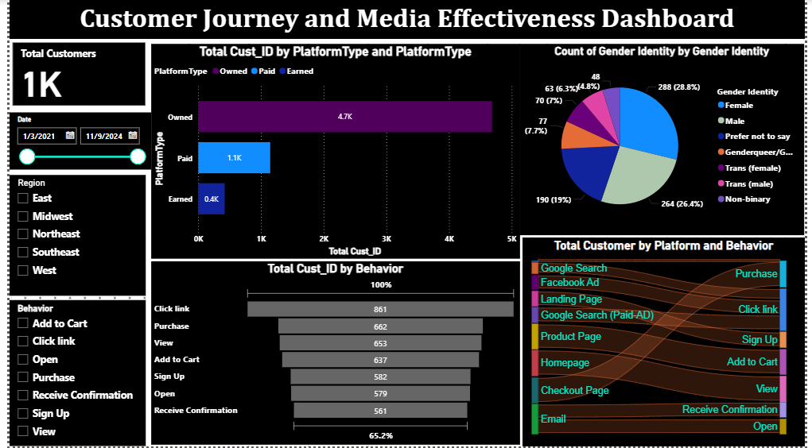
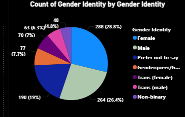
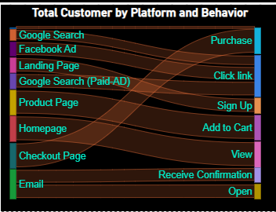
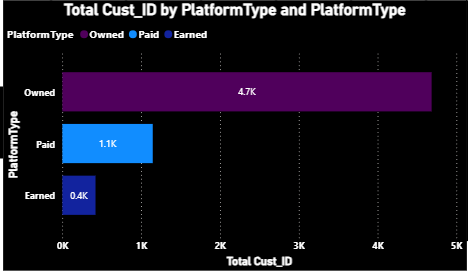

# 📈 Customer Journey & Media Effectiveness Dashboard

Power BI dashboard tracking **1,000 customers** across paid, owned, and earned media platforms to analyze customer behavior and conversion patterns.

## 📊 Dashboard Preview

## 🎯 Project Overview

This dashboard analyzes customer journey data to help marketing teams:
- Understand customer behavior across platforms
- Identify high-converting media channels
- Track demographic patterns
- Optimize marketing spend

## 🔑 Key Metrics

| Metric | Value |
|--------|-------|
| 👥 Total Customers | **1,000** |
| 📺 Owned Media | **4.7K** |
| 💰 Paid Media | **1.1K** |
| 🌟 Earned Media | **0.4K** |
| 📈 Conversion Rate | **65.2%** |

## 📊 Visualizations Included

- **Gender Identity Pie Chart** — Diverse demographic breakdown
- **Platform Type Analysis** — Owned vs Paid vs Earned comparison
- **Customer Behavior Funnel** — Click → Purchase journey
- **Sankey Diagram** — Customer journey flow visualization

## 🎛️ Interactive Features

- Date filter for time-based analysis
- Region filter (East, Midwest, Northeast, Southeast, West)
- Behavior filter (Click, Purchase, View, Sign Up)

## 🛠️ Tools & Technologies

- **Microsoft Power BI Desktop**
- **DAX Calculations**
- **Marketing Analytics**
- **Data Visualization**

## 💡 Key Insights

- Owned media (4.7K) drives the largest customer base
- Google Search and Facebook Ads are top acquisition channels
- 65.2% conversion rate indicates strong marketing funnel

## 👩‍💻 Author

**Pratima Kandel**  
🎓 Business Analytics Graduate Student | Webster University  
📍 St. Louis, MO

---

⭐ *If you found this project helpful, please give it a star!*
